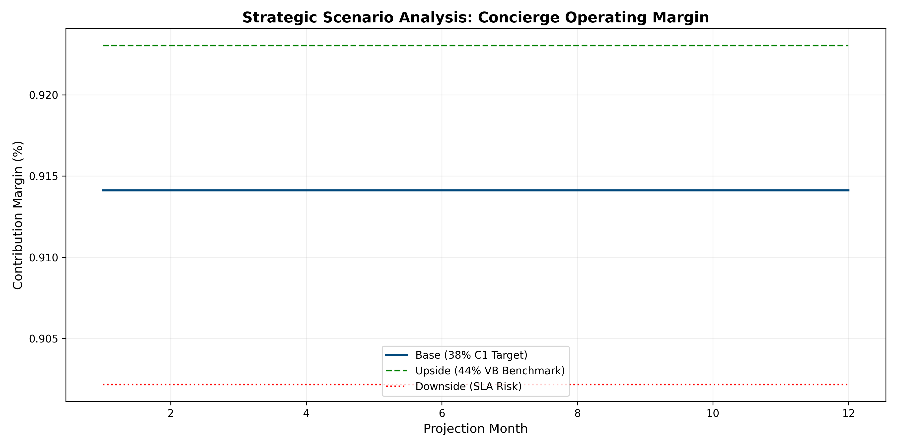

# Project Concierge: Unit Economic Analysis & Margin Optimization

## Executive Summary
This repository contains a synthetic case study and quantitative model focused on closing the **600 bps Contribution Margin (CM%) gap** between high-touch digital concierge services (Velocity Black) and traditional banking concierge models (Capital One).

## Repository Architecture
* **`data/`**: Synthetic datasets including member profiles and transactional request logs.
* **`docs/`**: Strategic artifacts including the `EXEC_MEMO.md` and `MONITORING_PLAN.md`.
* **`notebooks/`**: Step-by-step margin waterfall analysis and stochastic scenario modeling.
* **`src/`**: Modular Python scripts for data generation and quantitative analysis.

## Quantitative Methodology
The analysis utilizes **Monte Carlo simulations** (10,000 iterations) to define the breakeven request volume and revenue floor required to hit a 44% CM% benchmark while protecting the **89.2% Travel SLA**.

## Strategic Recommendation (30/60/90 Plan)
1. **30 Days**: Deploy weekly economics scorecard via automated Python/SQL triggers.
2. **60 Days**: Pilot pricing levers (Option A) and SLA stabilization protocols (Option C).
3. **90 Days**: Scale winning optimizations to capture the 6pp margin delta.

## Strategic Visualizations
### 12-Month Margin Projections

### Annual Profit Distribution (Monte Carlo)

---
**Author**: Brian Penrod, DBA  
**Target Role**: Sr. Business Manager, Concierge Economics

